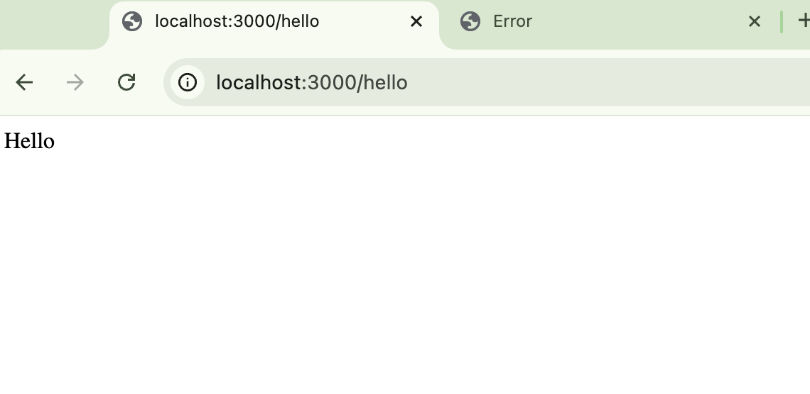
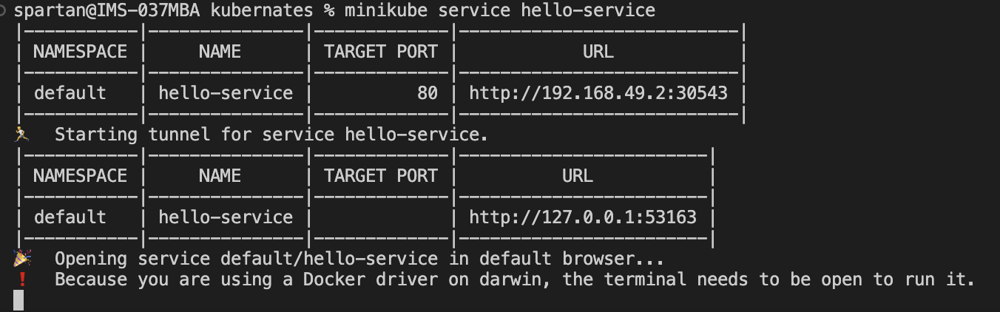
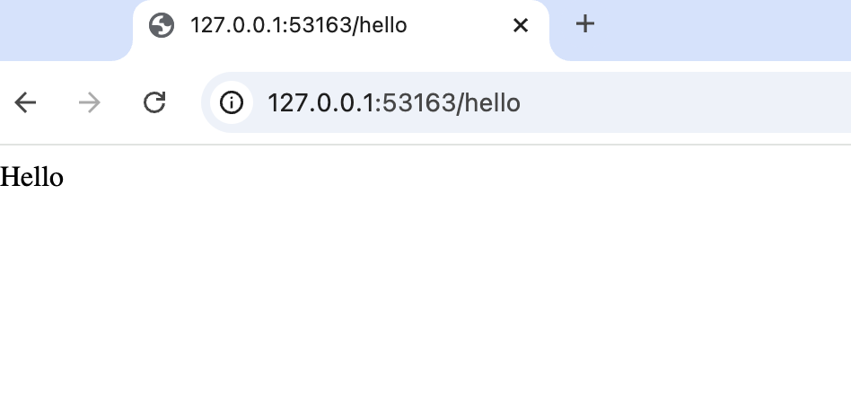
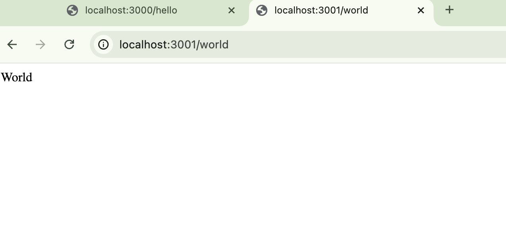
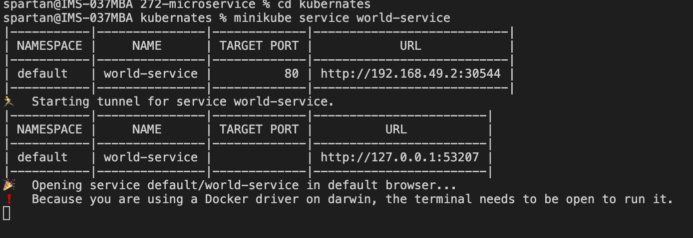
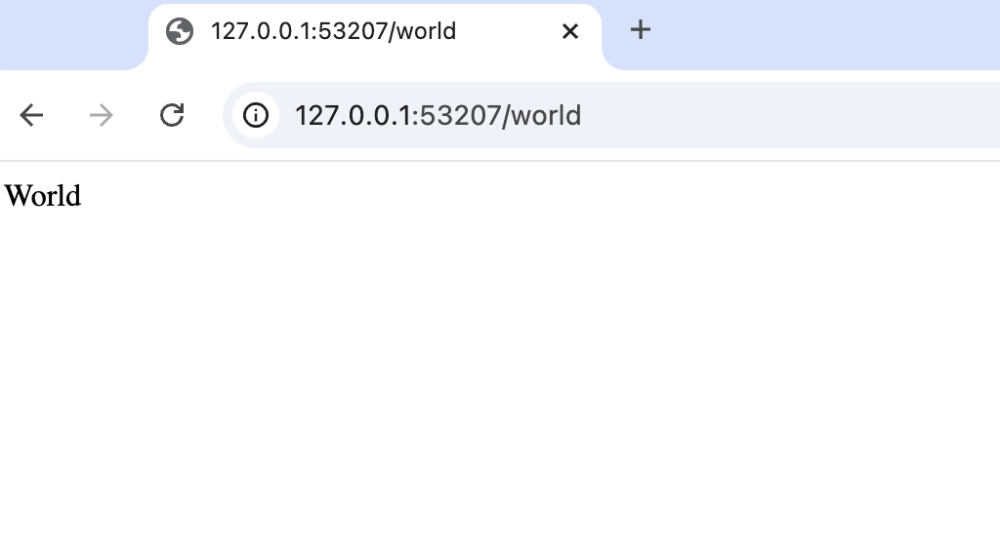
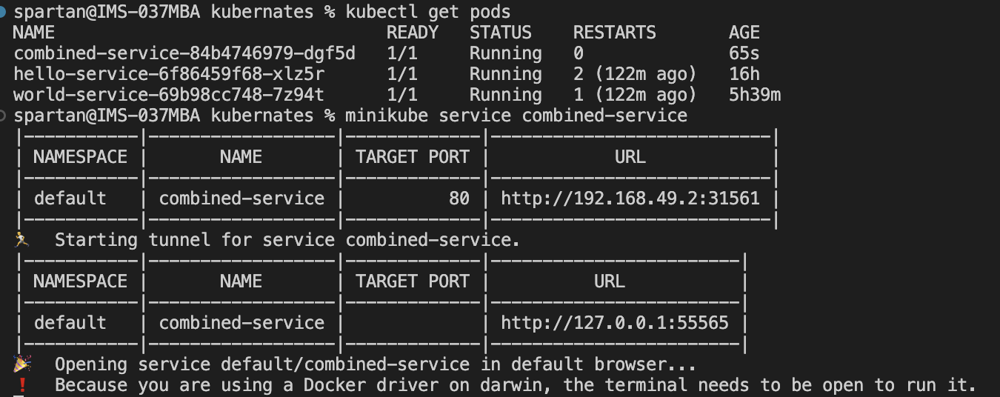
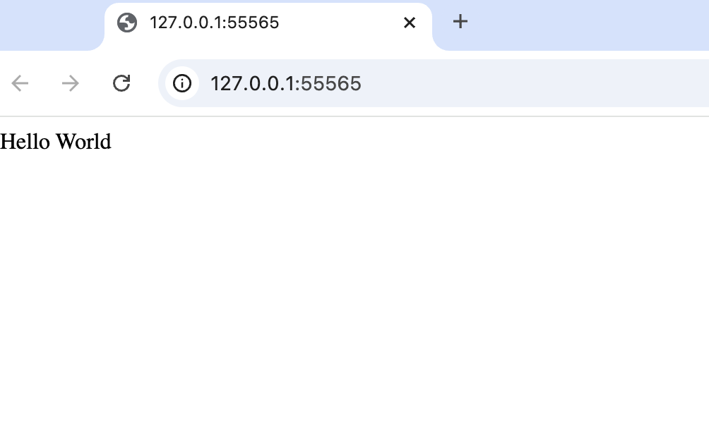

Initially I installed vs code 
Then installed docker and chose minikube for kubernates and installed it.
I installed minikube using 
```/bin/bash -c "$(curl -fsSL https://raw.githubusercontent.com/Homebrew/install/HEAD/install.sh)" ```
& 
```brew install minikube```

Cloned my git repo to vs code and used nodeJs and ExpressJs for creating two microservices 

## Hello-service
Created hello-service which returns a simple Hello message.
Here the endpoint is /hello and returns “Hello” string
Created a dockerfile for this microservice and built the docker image.
I used the commands as follows:
### Build the Docker image:
``` docker build -t vineelam23/hello-service:latest . ```
### Run the Docker container locally:
``` docker run -p 3000:3000 vineelam23/hello-service:latest ```

### Test the service locally: To access the service in your browser or via curl:
``` curl http://localhost:3000/hello ```
Or 
In browser the result is as follows:


### Push to Docker Hub: 
``` docker login ``` 
``` docker push vineelam23/hello-service:latest ```

Then deployment in kubernetes is done for this service 
The code is in the file hello-service.yaml

Used commands like:
``` minikube start ```
``` kubectl apply -f hello-service.yaml ```
Then check the kubernetes service is running or not:
``` minikube service hello-service ```

The output is:



## World-service
Also Created a world-service which returns a simple World message.
The endpoint here is /world and uses port as 3001 and returns “World” as a string in the browser.
Created dockerfile and also built the docker image and pushed to docker hub. 
Here is the link for created docker images in docker hub.


I used the commands like 
### Build the Docker image:
``` docker build -t vineelam23/world-service:latest . ```
### Run the Docker container locally:
``` docker run -p 3001:3000 vineelam23/world-service:latest ```

### Test the service locally: To access the service in your browser or via curl:
``` curl http://localhost:3001/world ```

Also checked if the service was running locally or not.
Below is the image for the test of the service locally.



### Push to Docker Hub: 
``` docker push vineelam23/world-service:latest ```

Then deployment in kubernetes is done for this world service.
Used minikube for kubernetes cluster setup and deployment.
The code is in the file world-service.yaml

Used commands like:
``` minikube start ```
``` kubectl apply -f world-service.yaml ```
Then check if the kubernetes service is running or not using the below command.
``` minikube service world-service ```

Output is:



Both the services are running successfully in kubernetes setup.

And then created a simple service which calls both the endpoints and prints “Hello World” if both the services respond correctly.
I created a service named combined-service and containerized with docker and then deployed this service using kubernetes similarly.

Here are the commands used and the test result for the combined script. 
``` docker build -t vineelam23/combined-service:latest . ```
``` docker push vineelam23/combined-service:latest ```

### Used commands like:
``` kubectl get pods```
```kubectl get service```
``` kubectl get deployment ```

### Used to apply configuration:
``` kubectl apply -f combined-service.yaml ```
### Used to test the service:
``` minikube service combined-service ```





## the directory structure is:
272-microservice/ ├── hello-service/ │ ├── Dockerfile │ └── index.js ├── kubernates/ │ ├── combined-service/ │ │ ├── app.js │ │ └── Dockerfile │ ├── hello-service.yaml │ └── world-service.yaml └── world-service/ ├── Dockerfile └── index.js